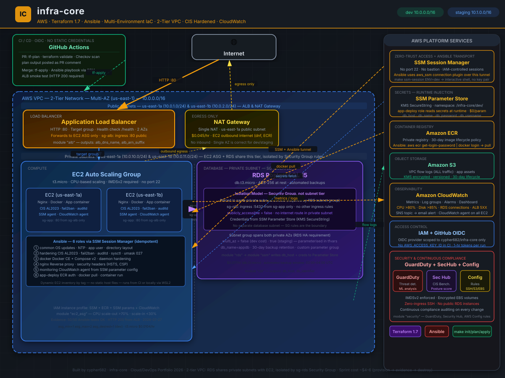

# infra-core

[](https://www.terraform.io/)
[](https://aws.amazon.com/)
[](https://www.ansible.com/)
[](https://github.com/cypher682/infra-core/actions/workflows/tf-plan.yml)
[](LICENSE)

Production-grade AWS infrastructure platform provisioned with Terraform, hardened with Ansible, and delivered through a GitHub Actions OIDC pipeline — multi-environment, fully modular, CIS-compliant.

infra-core covers the full provisioning lifecycle: 2-tier VPC design (public + private subnets), EC2 Auto Scaling, RDS PostgreSQL (private subnet, SG-isolated), ECR container delivery, SSM-based secrets, and a continuous SecOps baseline with GuardDuty, Security Hub, and AWS Config — with no open SSH ports, no static CI credentials, and no manually configured servers.

---

## Highlights

- Modular Terraform across dev and staging environments with isolated state backends and non-overlapping CIDRs
- 2-tier VPC: public subnets (ALB & NAT Gateway) and private subnets (EC2 ASG & RDS) — isolated via Security Group rules
- Zero port 22 anywhere — all EC2 access via AWS SSM Session Manager, scoped to IAM identity
- GitHub Actions OIDC federation — no `AWS_ACCESS_KEY_ID` in CI secrets; temporary scoped tokens per run
- KMS-encrypted SSM Parameter Store for runtime secrets — never written to Terraform state or source code
- Ansible over SSM with dynamic EC2 inventory — idempotent, tag-driven, no static host files or key pairs
- CIS Amazon Linux 2023 hardening: `fail2ban`, `auditd`, sysctl tuning, umask 027, root login disabled
- CloudWatch alarms (CPU, disk, RDS connections, ALB 5XX) with SNS email notifications and operational dashboard
- GuardDuty threat detection, Security Hub CIS Benchmark scoring, AWS Config compliance rules
- Checkov IaC security scan gates every PR — merge blocked on critical findings
- Smoke-tested end-to-end: 79 resources, 50 Ansible tasks, HTTP 200 from ALB on live deployment
- Sprint cost model: full stack runs for under $1/hour; provision → validate → destroy

---

## Architecture



### Traffic Flow

```
Internet (HTTP :80)
        |
        v
  ALB -- public subnets, 2 AZs, health-checked
        |
        v
  EC2 ASG -- private subnets, 2 AZs
  (CIS-hardened, Docker + Nginx, CloudWatch agent)
        |
        v (:5432, sg-rds from sg-app only)
  RDS PostgreSQL -- same private subnets as EC2, isolated by SG rule
                    (no separate database subnet — SG is the boundary)
```

### Platform Services

| Service | Role |
|---|---|
| **GitHub Actions OIDC** | Keyless CI/CD — `tf-plan` on PR, `tf-apply` on merge, Checkov gate |
| **SSM Session Manager** | Zero-trust EC2 access — no port 22, no bastion, no key pairs |
| **SSM Parameter Store** | Runtime secrets (KMS SecureString) — never in code or state |
| **Amazon ECR** | Docker registry — Ansible `app-deploy` role pulls and runs containers |
| **S3** | VPC flow logs + app assets (encrypted, versioned, lifecycle-managed) |
| **CloudWatch** | Metrics, alarms, log groups, SNS email alerts, operational dashboard |
| **GuardDuty** | ML-based threat detection on API calls and network flows |
| **Security Hub** | CIS Foundations benchmark scoring + findings aggregation |
| **AWS Config** | Automated compliance rules for SSH exposure, S3, EBS encryption |

---

## Stack

| Layer | Technology |
|---|---|
| Infrastructure as Code | Terraform 1.7 — fully modular, multi-environment |
| Configuration Management | Ansible + CIS Amazon Linux 2023 hardening |
| Compute | EC2 ASG (t3.micro) behind Application Load Balancer |
| Database | RDS PostgreSQL 15 (db.t3.micro, private subnet, SG-isolated, encrypted) |
| Container Registry | Amazon ECR with lifecycle policy |
| Secrets | SSM Parameter Store (SecureString + KMS CMK) |
| Observability | CloudWatch metrics, log groups, CPU/disk/RDS alarms, dashboard |
| CI/CD | GitHub Actions + OIDC — zero static AWS credentials |
| Security | GuardDuty, Security Hub, AWS Config, IMDSv2, fail2ban, auditd, Checkov |

---

## Repository Structure

```
infra-core/
├── modules/
│   ├── state-backend/    # S3 + DynamoDB remote state (separate lifecycle)
│   ├── vpc/              # VPC, subnets (public + private, 2 tiers), SGs, NAT, flow logs
│   ├── iam/              # GitHub OIDC IdP + role, EC2 instance profile
│   ├── s3/               # App assets + flow logs buckets (encrypted, private)
│   ├── ssm/              # Parameter Store namespace + KMS key
│   ├── rds/              # PostgreSQL in private subnet, SG-isolated, automated backups
│   ├── alb/              # ALB, target group, HTTP listener, health check
│   ├── ec2-asg/          # Launch template, ASG, CPU scaling policies, user_data
│   ├── ecr/              # ECR repository + 30-day lifecycle policy
│   └── cloudwatch/       # Alarms, log groups, SNS topic, dashboard
├── environments/
│   ├── dev/              # CIDR 10.0.0.0/16 — public 10.0.1-2.0/24, private 10.0.10-11.0/24
│   └── staging/          # CIDR 10.1.0.0/16 — same subnet layout, separate state
├── ansible/
│   ├── site.yml          # Top-level playbook (runs all roles in order)
│   ├── ansible.cfg       # SSM connection plugin config
│   ├── group_vars/all.yml
│   ├── inventory/        # Dynamic AWS SSM inventory (tag-based, no static IPs)
│   └── roles/
│       ├── common/       # OS updates, NTP, app user, directory layout
│       ├── hardening/    # CIS AL2023 baseline -- fail2ban, auditd, sysctl, umask
│       ├── docker/       # Docker CE + Compose v2, daemon hardening
│       ├── nginx/        # Reverse proxy, security headers (HSTS, CSP, X-Frame)
│       ├── monitoring/   # CloudWatch agent from SSM parameter config
│       └── app-deploy/   # ECR auth, docker pull, container run
└── .github/workflows/
    ├── tf-plan.yml       # PR: init + validate + Checkov + plan -> PR comment
    └── tf-apply.yml      # Merge: apply + Ansible + ALB smoke test
```

---

## Quick Start

### Prerequisites

| Tool | Version | Note |
|---|---|---|
| Terraform | >= 1.6 | [Install](https://developer.hashicorp.com/terraform/install) |
| AWS CLI | >= 2.x | Configured with valid credentials |
| Ansible | >= 2.14 | WSL2 required on Windows |
| `amazon.aws` collection | latest | `ansible-galaxy collection install amazon.aws` |
| `community.general` | latest | `ansible-galaxy collection install community.general` |

### 1. Bootstrap remote state (one-time)

```bash
cd modules/state-backend
terraform init && terraform apply
```

### 2. Set credentials

```bash
export TF_VAR_db_password="your-secure-password"
export TF_VAR_db_username="appuser"
export AWS_ACCOUNT_ID="123456789012"
```

### 3. Update tfvars

Edit `environments/dev/terraform.tfvars`:

```hcl
aws_account_id = "123456789012"
alert_email    = "you@example.com"
```

### 4. Provision infrastructure

```bash
make init ENV=dev
make plan ENV=dev
make apply ENV=dev
```

### 5. Run Ansible hardening (WSL2)

```bash
make ansible ENV=dev
# -> 50 tasks, all OK -- CIS hardening + Docker + Nginx + app deployed
```

### 6. Smoke test

```bash
make smoke ENV=dev
# -> {"status":"ok","service":"infra-core"}
```

### 7. Access EC2 (no SSH port required)

```bash
make ssm-session ENV=dev
# -> Opens interactive shell on a private EC2 instance via SSM
```

### 8. Teardown

```bash
make destroy ENV=dev
```

---

## CI/CD Pipeline

### On Pull Request -> `tf-plan.yml`

```
Checkout
  -> Configure AWS (OIDC, no static keys)
       -> terraform init + validate
            -> Checkov IaC scan (blocks merge on failure)
                 -> terraform plan
                      -> Post plan as PR comment
```

### On Merge to `main` -> `tf-apply.yml`

```
Checkout
  -> Configure AWS (OIDC)
       -> Login to ECR -> build + push Docker image
            -> terraform apply -auto-approve
                 -> Install Ansible -> run playbook via SSM
                      -> ALB smoke test (HTTP 200 required)
```

The apply pipeline is **idempotent** — running it against already-provisioned infrastructure produces no changes unless source code or variables have changed. The Ansible roles are equally idempotent; re-running hardening against an already-hardened host is safe.

---

## GitHub Actions Setup

Add the following secrets to the repository (`Settings -> Secrets -> Actions`):

| Secret | How to get it |
|---|---|
| `AWS_ROLE_ARN` | `terraform output -raw github_actions_role_arn` (after first apply) |
| `AWS_ACCOUNT_ID` | 12-digit AWS account number |
| `DB_PASSWORD` | RDS master password |
| `DB_USERNAME` | RDS master username |
| `ALERT_EMAIL` | Email address for CloudWatch SNS alerts |

OIDC is pre-configured — **no `AWS_ACCESS_KEY_ID` or `AWS_SECRET_ACCESS_KEY` needed.**

---

## Security Controls

| Control | Implementation |
|---|---|
| **Threat detection** | GuardDuty — ML analysis of CloudTrail, VPC flow logs, DNS logs |
| **Posture management** | Security Hub — continuous CIS Foundations Benchmark v1.4 scoring |
| **Automated compliance** | AWS Config — SSH exposure, public S3, unencrypted EBS |
| **No public database** | RDS in database subnets only, `publicly_accessible = false` |
| **No SSH ports** | Zero port 22 rules; all access via SSM Session Manager |
| **IMDSv2 enforced** | `http_tokens = required` in EC2 launch template |
| **Encrypted at rest** | RDS, EBS, S3 — AES-256 across all storage layers |
| **Secrets at runtime** | SSM SecureString — never appears in Terraform state or environment files |
| **Least-privilege IAM** | Per-service scoped roles; no `AdministratorAccess` anywhere |
| **IaC security gate** | Checkov scans every PR; merge blocked on any critical finding |
| **CIS hardening** | fail2ban, auditd, root SSH disabled, sysctl hardening, umask 027 |
| **VPC flow logs** | ALL traffic captured to S3, 30-day lifecycle, KMS encrypted |
| **No long-lived CI keys** | GitHub Actions OIDC — 1-hour scoped temporary credentials per run |

---

## Multi-Environment Design

Both environments are isolated at the Terraform state, CIDR, and AWS resource levels. Promoting from `dev` to `staging` means editing `environments/staging/terraform.tfvars` — no module changes required.

| Property | dev | staging |
|---|---|---|
| VPC CIDR | 10.0.0.0/16 | 10.1.0.0/16 |
| Public subnets | 10.0.1.0/24, 10.0.2.0/24 | 10.1.1.0/24, 10.1.2.0/24 |
| Private subnets | 10.0.10.0/24, 10.0.11.0/24 | 10.1.10.0/24, 10.1.11.0/24 |
| RDS placement | Private subnets, SG-isolated | Private subnets, SG-isolated |
| State bucket prefix | `infra-core-dev` | `infra-core-staging` |
| EC2 desired capacity | 1 | 2 |
| RDS Multi-AZ | `false` | `true` |
| CloudWatch retention | 7 days | 30 days |

---

## Cost Model

This project uses a **sprint model**: provision -> validate -> capture evidence -> destroy. No idle cost.

| Resource | Rate | 8-hour sprint | 48-hour sprint |
|---|---|---|---|
| NAT Gateway | $0.045/hr | ~$0.36 | ~$2.20 |
| ALB | $0.008/hr | ~$0.06 | ~$0.40 |
| EC2 t3.micro | $0.0104/hr | ~$0.08 | ~$0.50 |
| RDS db.t3.micro | $0.017/hr | ~$0.14 | ~$0.82 |
| S3 + CloudWatch | minimal | ~$0.02 | ~$0.10 |
| **Total** | | **< $1** | **~$4–6** |

Continuous run (if kept up): ~$75–90/month. The sprint model lets you exercise enterprise-grade architecture for the cost of a coffee.

---

## Evidence Captured

Deployment successfully validated end-to-end on 2026-07-27:

| Evidence | Status |
|---|---|
| Terraform apply — 79 resources created | OK |
| SSM PingStatus: Online on EC2 fleet | OK |
| Ansible playbook — 50 tasks, 0 failures | OK |
| ALB health check: HTTP 200 {"status":"ok"} | OK |
| GuardDuty + Security Hub enabled | OK |
| Checkov scan — zero critical findings | OK |

---

## Lessons Learned

| Problem | Root Cause | Fix |
|---|---|---|
| `amazon-ssm-agent` boot failure | AL2023 requires `dnf install` before `systemctl enable` | Added explicit `dnf install amazon-ssm-agent` to `user_data.sh` |
| `docker-compose-plugin` not found | AL2023 uses Docker CE v2 binary, not the plugin package | Binary install from GitHub releases |
| ECR pull `no basic auth credentials` | Docker daemon does not inherit instance profile; requires explicit login | `aws ecr get-login-password \| docker login` in `app-deploy` role |
| `curl` package conflict | AL2023 ships `curl-minimal`; `curl` conflicts | Removed `curl` from `common` role package list |
| Ansible cron task fails on fresh host | `/etc/cron.d` may not exist before first run | Added `state: directory` task before cron file write |
| IMDSv2 blocks raw metadata curl | Token required for `http_tokens = required` | Use `X-aws-ec2-metadata-token` header |

---

## Natural Next Steps

- **HTTPS listener** — ACM cert + HTTPS listener block is pre-documented in `modules/alb/main.tf`
- **Multi-AZ RDS** — `multi_az = true` in staging tfvars; already parameterised
- **EKS migration** — VPC, ALB, and IAM modules map directly: ASG -> Deployment, ALB -> Ingress, SSM -> Secrets Store CSI Driver
- **ArgoCD GitOps** — replace `tf-apply` Ansible step with ArgoCD sync from the same repository
- **Cross-region DR** — RDS snapshot replication + S3 CRR to `us-west-2`; modules are replication-ready

---

## Related Documentation

- [`infra-core-what-is.md`](../infra-core-what-is.md) — plain-language deep dive: architecture, real-world use cases, interview Q&A
- [`infra-core-content-drafts.md`](../infra-core-content-drafts.md) — LinkedIn, Dev.to, and X publishing drafts
- [`infracore-build-overview.md`](../infracore-build-overview.md) — chronological build log
- [`infra-core-deployment-and-evidence-guide.md`](../infra-core-deployment-and-evidence-guide.md) — step-by-step evidence capture guide

---

*Part of the [2026 Cloud/DevOps Portfolio Sprint](https://github.com/cypher682) · Built by [cypher682](https://github.com/cypher682)*
